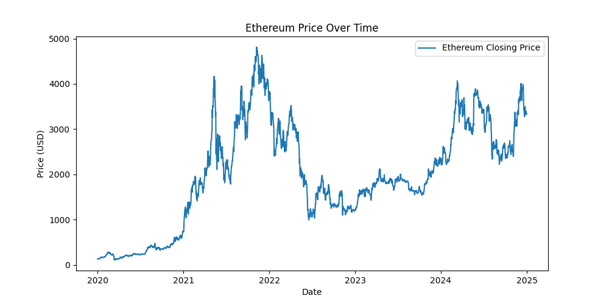
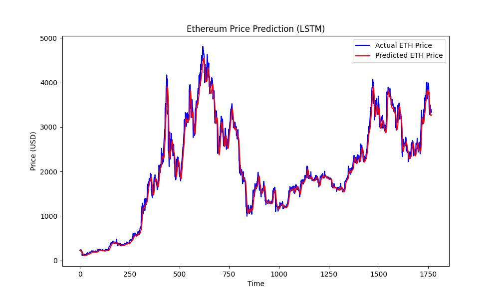

# Project-3

## Introduction

The goal of this project is to apply the Stock-to-Flow (S2F) model to predict the price of Ethereum (ETH), the second-largest cryptocurrency by market capitalization. The Long Short-Term memory (LSTM) model, it takes the last 60 prices (as input) and learns a relationship between them to guess what the next price might be.T his makes LSTM great for financial predictions, where patterns often repeat.

## Long Short-Term Memory Model

An LSTM regression model (Long Short-Term Memory) is a type of neural network designed to learn patterns and relationships from time-dependent data, such as cryptocurrency prices. Unlike regular regression models that treat each data point independently, an LSTM can “remember” information from previous time steps, making it ideal for analyzing sequences. This memory feature helps the model understand how past values influence future ones. 

In the context of predicting Ethereum’s price, an LSTM regression model takes in a series of past prices and learns the underlying trends, fluctuations, and patterns in how the price moves over time. It then uses this knowledge to predict the next price or future values. Because Ethereum’s price is affected by market trends, trading activity, and historical patterns, an LSTM model is especially useful since it can capture the temporal dependencies and complex nonlinear relationships in the data, leading to more accurate and realistic price predictions than simpler models.

## Data Understanding

The Ethereum dataset obtained from Yahoo Finance contains daily market information with columns such as Open, High, Low, Close, Adj Close, and Volume, each representing different aspects of Ethereum’s trading activity in U.S. dollars. The Open, High, Low, and Close prices are usually highly correlated since they all describe Ethereum’s value within the same day, while Volume reflects the total amount of trading and can sometimes indicate strong buying or selling pressure before major price movements. By analyzing this data, we can identify important patterns such as overall upward or downward trends, short-term volatility spikes, and periods of increased trading activity.

## Data Pre-Processing

For this project, I performed several data preprocessing steps to prepare the Ethereum dataset for analysis. I first collected daily historical price data using the Yahoo Finance API and extracted only the necessary columns such as date and closing price. The date column was then converted into a datetime format and grouped by year to estimate annual values. Next, I engineered new features to represent Ethereum’s stock (total supply), flow (newly issued ETH), and the Stock-to-Flow (S2F) ratio, which measures scarcity. Missing values created during differencing were handled using backward filling to maintain data continuity. To linearize the power-law relationship between scarcity and price, both the S2F ratio and price were log-transformed before applying regression. Finally, rows with missing or invalid values were removed to ensure a clean and consistent dataset for modeling.

## Evaluation

